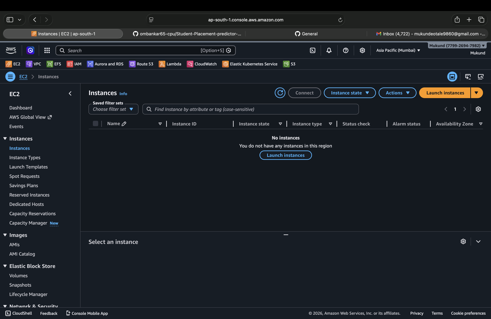
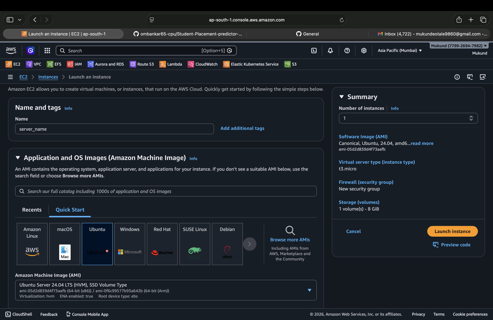
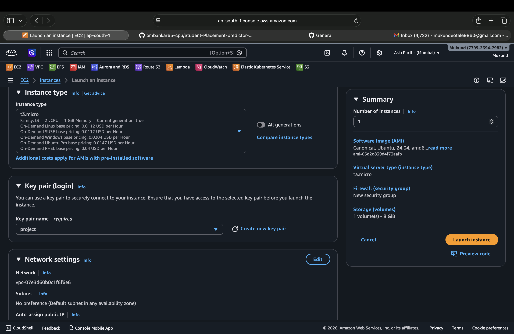
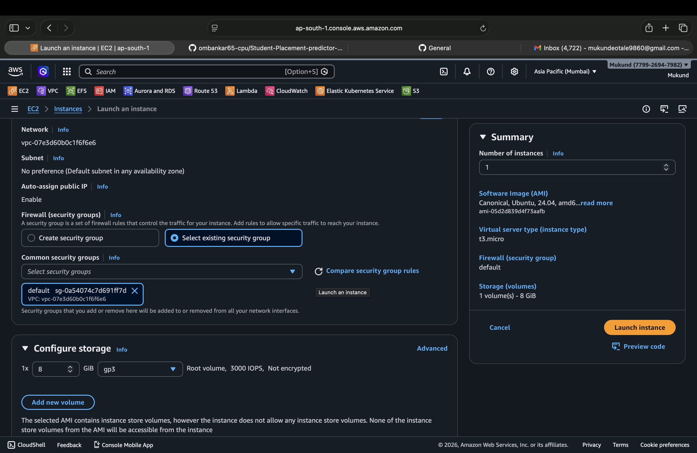
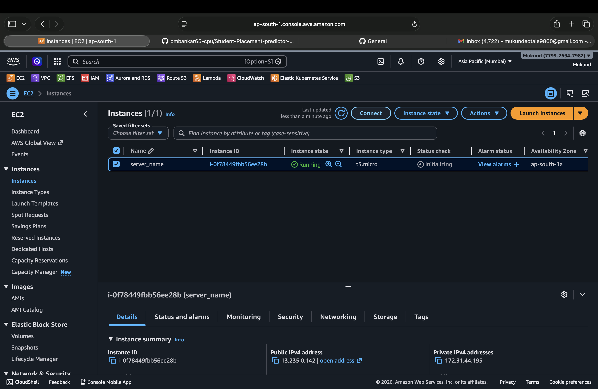
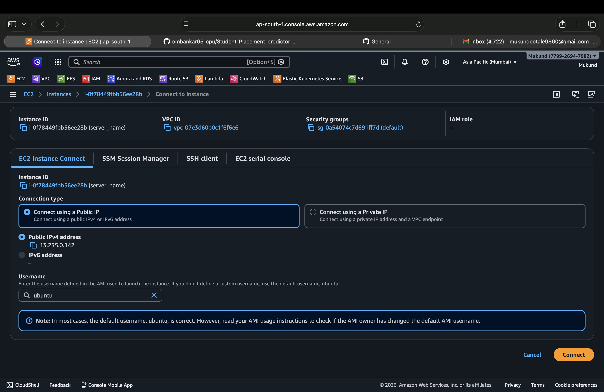
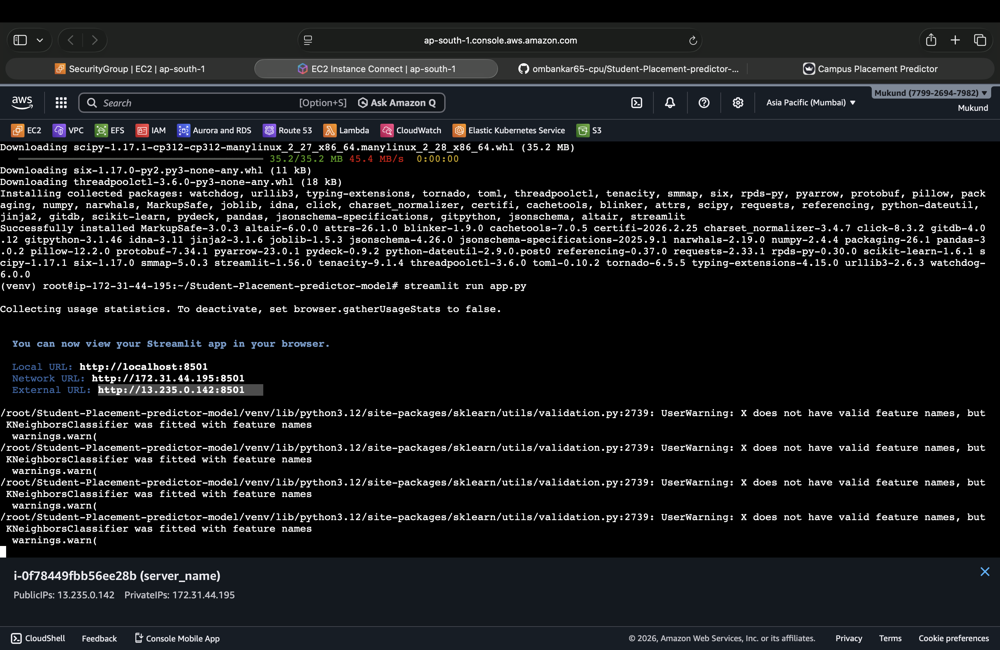
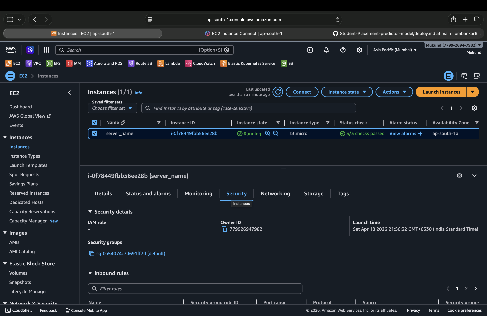
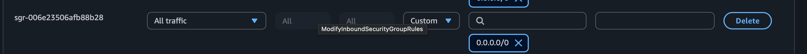

## Log in to AWS consol and navigate to Ec2 Instance 
- step 1 : navigate to ec2 instance and click on lanch instance 




- step 2: chose key pair and instance type according to reqirement



- step 3: chose existing sequrity group defalt to avoid confusion



- step 4: lanch ec2 instance and take ssh to ec2 instance





- step 5: exicute command on ec2 instance terminal
```bash
sudo -i
apt update -y
```

- step 6: clone the repository and install dependancies
```bash
git clone https://github.com/ombankar65-cpu/Student-Placement-predictor-model.git
```

- step 7: install python adn set environment
```bash
sudo apt install python3 python3-pip python3-venv -y
cd ~/Student-Placement-predictor-model
```
```
python3 -m venv venv
source venv/bin/activate
```

- step 8: run application
```bash
pip install --upgrade pip
pip install -r requirements.txt
streamlit run app.py
```


### History for refrance 
```bash
ls
sudo apt update -y
git clone https://github.com/ombankar65-cpu/Student-Placement-predictor-model.git
sudo apt install python3 python3-pip python3-venv -y
cd ~/Student-Placement-predictor-model
python3 -m venv venv
source venv/bin/activate
pip install --upgrade pip
pip install -r requirements.txt
streamlit run app.py
```

## If any Error Occurs that probably becase of Sequrity group port number is not allowed 
- navigate to SG in ec2 instance

- check for inbound port which ports are allowed and check and edit inbound port 


- if reqierd port is not enabled as application is running on http://public_IP:8501
- stimlit run on 8501 port so vitalist that port or allow all trafic on IPv4 anywhere




